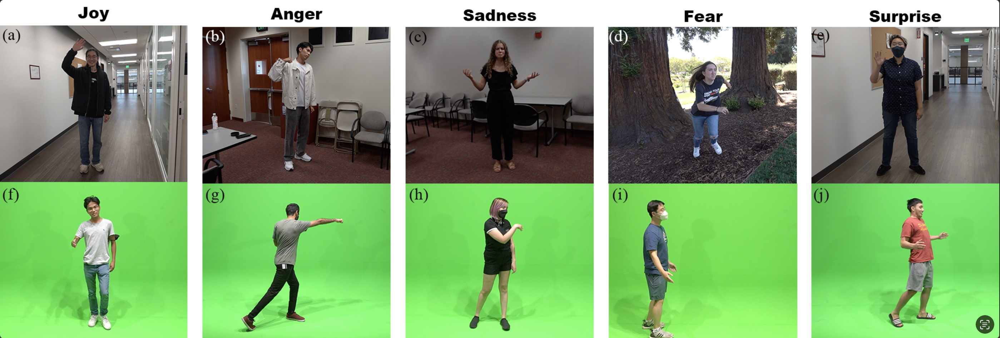

# MoEmo Vision Transformer
MoEmo Vision Transformer is a new approach in HRI(human-robot interaction) because it uses cross-attention and movement vectors to enhance 3D pose estimation for __emotion detection__. Recent developments in HRI emphasize why robots need to understand human emotions. Most papers focus on facial expressions to recognize emotions, but we focus on human body movements, and consider context. Context is very important for emotions because the same pose with different contexts will show different emotions.

<div align="center">
    
</div>

# News!
- Dec 2023: [SoloPose](https://github.com/Santa-Clara-Media-Lab/SoloPose) is released!
- Nov 2023: Our paper's codes are released!
- Oct 2023: Our paper was accepted by IROS 2023 (IEEE/RSJ International Conference on Intelligent Robots and Systems).

# Installation
## Conda environment
```shell
conda create -n MoEmo python=3.7
conda activate MoEmo
```
## torch
[PyTorch >= 1.7](https://pytorch.org/) + [CUDA](https://developer.nvidia.com/cuda-downloads)
```
pip install torch==1.11.0+cu113 torchvision==0.12.0+cu113 torchaudio==0.11.0 --extra-index-url https://download.pytorch.org/whl/cu113
```

## visuial

- FFmpeg (if you want to export MP4 videos)
- ImageMagick (if you want to export GIFs)

## 3D Pose Estimator

- tqdm
- pillow
- scipy
- pandas
- h5py
- visdom
- nibabel
- opencv-python (install with pip)
- matplotlib


# Pre-trained model
You need to download the 2D pose estimator for the P-STMO, and then download the Pre-trained P-STMO wild data model for the 3D pose estimator.

1. Git the 2D pose estimator codes
```
git clone https://github.com/zh-plus/video-to-pose3D.git
```

2. Download pre-trained ALphapose as a 2D pose estimator

- Download **duc_se.pth** from ([Google Drive](https://drive.google.com/open?id=1OPORTWB2cwd5YTVBX-NE8fsauZJWsrtW) | [Baidu pan](https://pan.baidu.com/s/15jbRNKuslzm5wRSgUVytrA)),
         place to `./joints_detectors/Alphapose/models/sppe`


3. Download pre-trained YOLO as the human detection model
- In order to handle multi-person in videos, we apply YOLO in advance to detect humans in frames.

- Download **yolov3-spp.weights** from ([Google Drive](https://drive.google.com/open?id=1D47msNOOiJKvPOXlnpyzdKA3k6E97NTC) | [Baidu pan](https://pan.baidu.com/s/1Zb2REEIk8tcahDa8KacPNA)),
         place to `./joints_detectors/Alphapose/models/yolo`

4. Download the P-STMO codes
```
git clone https://github.com/paTRICK-swk/P-STMO.git
```
- Download pre-trained models from [here](https://drive.google.com/file/d/1vLtC86_hs01JKKRQ6akvdH5QDKxt71cY/view?usp=sharing). Put the checkpoint in the `checkpoint/` folder of video-to-pose3D.
- Put the `model/` folder and `in_the_wild/videopose_PSTMO.py` in the root path of their repo.
- Put `in_the_wild/arguments.py`, `in_the_wild/generators.py`, and `in_the_wild/inference_3d.py` in the `common/` folder of their repo.


5. Our model‘s checkpoints

- Dowload [here](https://drive.google.com/file/d/1Ur4o0GXug_g1zMAjNI23SGKM4JzacD5A/view?usp=drive_link)


# Data Prepare
Please ensure you have done everything before you move to the following steps.

1. place your video(input data) into `./outputs` folder. (I've prepared a test video).
2. run the 3D pose estimator
```
python videopose_PSTMO.py
```
- After this code, you will get the 3D key point coordinates, which will be stored in '.npy' files. This is one of our model's inputs.

3. run CLIP model to get the context's feature maps
```
python ./data/preCLIP.py
```
- After this code, you will get the context's feature map, which is another of our model's inputs.


# Usage
```
python ./network/train.py
```


## Citation
If you find this repo useful, please consider citing our paper:
```
@article{DBLP:journals/corr/abs-2310-09757,
  author       = {David C. Jeong and
                  Tianma Shen and
                  Hongji Liu and
                  Raghav Kapoor and
                  Casey Nguyen and
                  Song Liu and
                  Christopher A. Kitts},
  title        = {MoEmo Vision Transformer: Integrating Cross-Attention and Movement
                  Vectors in 3D Pose Estimation for {HRI} Emotion Detection},
  journal      = {2023 IEEE/RSJ International Conference on Intelligent Robots and Systems(IROS)},
  year         = {2023}
}
```
